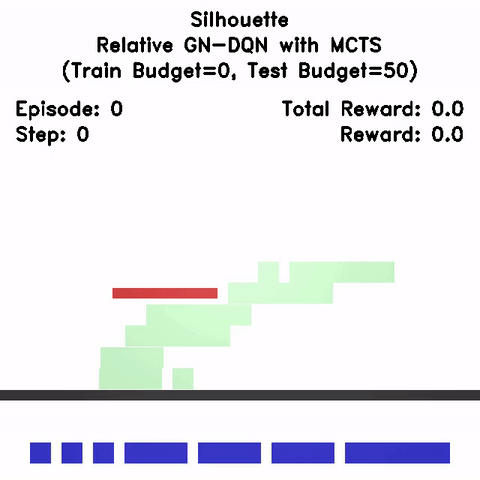
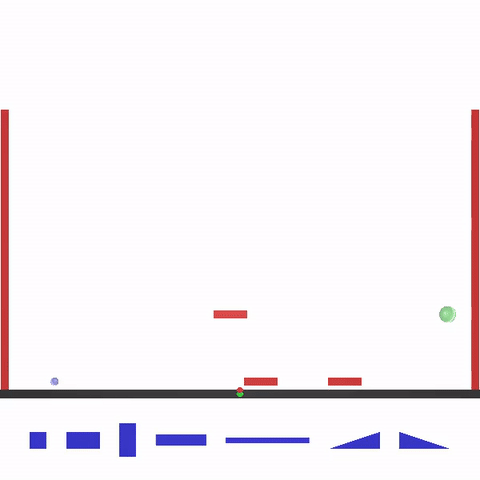

# Construction Tasks

See the
[Environment Loading](https://github.com/deepmind/dm_construction/blob/master/demos/environment_loading.ipynb)
notebook demo for a demonstration of how to load and interact with the
environments.

## Task Structure

All tasks involve stacking blocks in order to achieve some goal, such as
mimicking a given structure or supporting a block at a target location. However,
this must be done while avoiding collisions with obstacles in the scene.

### Overall Behavior

All tasks except Marble Run have the same overall behavior:

1.  Pick one of several "available blocks" and place it in the scene.
2.  Possibly terminate the episode with Bad Choice or Invalid Edge.
3.  Run physics until everything settles.
4.  Based on the results of physics, compute reward and possibly terminate the
    episode with Spawn Collision, Obstacle Hit, Complete, Max Steps, or Bad
    Simulation.

In the case of Marble Run, there is slightly different behavior:

1.  Pick one of several "available blocks" and place it in the scene.
2.  Possibly terminate the episode with Bad Choice or Invalid Edge.
3.  Run physics of all objects *except the ball* until everything settles.
4.  Based on the results of physics, possibly terminate the episode with Spawn
    Collision, Obstacle Hit, or Bad Simulation.
5.  Run physics of all objects *including the ball* until the ball collides with
    an obstacle, reaches the goal, or a max number of simulation steps is
    reached.
6.  Based on the results of physics, compute reward and possibly terminate the
    episode with Complete, Max Steps, Bad Simulation, or Spawn Collision (with
    the ball).
7.  Reset the environment to the state it was in before Step 5.

### Rewards

Note that in all tasks, reward is given based on the difference between the
previous timestep and the current timestep. For example, in the Covering task,
if an action covers an obstacle by an additional 0.5 units compared to the
previous timestep, then a reward of 0.5 will be otained on that timestep (but
not on future timesteps, even if that length is still covered). If the condition
leading to a reward is reversed---for example, if the obstacle becomes
uncovered---then the agent will obtain a negative reward.

### Terminations

There are several reasons why the episode might terminate:

*   **Spawn Collision**: the block that was placed into the scene is overlapping
    with another object, which is physically not possible.
*   **Obstacle Hit**: one or more objects in the scene have collided with a red
    obstacle.
*   **Max Steps**: the task has run out of time or there are no more available
    objects.
*   **Complete**: the task is complete!
*   **Bad Simulation**: in rare cases, the underlying Unity environment may run
    into an error, which will cause this termination type to happen.
*   **Bad Choice**: only relevant in the Covering Hard task and only when not
    using relative discrete actions. This termination type will happen if an
    agent tries to select an available object that is no longer available.
*   **Invalid Edge**: only relevant when using relative discrete actions. This
    will happen if the agent chooses an edge which goes from an object which is
    not an available object.

By default, none of these termination types are associated with penalties to the
agent (though you can configure some of them when constructing the environment).

### Options

There are some options that are common to all tasks and which you can pass in as
extra arguments to `get_environment`:

*   `difficulty`: The difficulty level of the task. The max difficulty is
    different for different tasks and can be accessed via
    `env.core_env.max_difficulty`. You can either set this value via the
    constructor, or if you leave it unset, you can set it on a per episode-basis
    by passing it as an argument to `env.reset()`. The current difficulty level
    can be accessed via `env.core_env.difficulty`.
*   `curriculum_sample`: This option is usually only used during training with a
    curriculum, and is designed so that agents do not forget about previous
    difficulties. Specifically, `curriculum_sample` controls whether the
    difficulty of a particular episode is equal to the current difficulty
    setting (setting of `False`), or whether it is sampled from a range of
    difficulties spanning the minimum difficulty (0) to the current difficulty
    (setting of `True`). The value of the actual difficulty sampled for the
    current episode can be accessed using `env.core_env.episode_difficulty`,
    which will be less than or equal to `env.core_env.difficulty` when
    `curriculum_sample==True`, and equal to `env.core_env.difficulty` when
    `curriculum_sample==False`. Like `difficulty`, this can be set either in the
    constructor of the environment or on a per-episode basis by passing it as an
    argument to `env.reset()`.
*   `sticky_penalty`: This controls the penalty for making blocks sticky. The
    default value varies across tasks, and can be overwritten by passing this as
    an argument to the constructor in order to further manipulate the
    difficulty. For example, the Reaching task with a large `sticky_penalty` is
    quite challenging!

Some environments have additional generalization levels that can be configured
by passing the name of the level as a string via the difficulty parameter (with
`curriculum_sample=False`).

For more details on `difficulty` and `curriculum_sample`, see the
[Environment Difficulty](https://github.com/deepmind/dm_construction/blob/master/demos/task_difficulties.ipynb)
notebook.

## Specific Tasks

### Silhouette

In the Silhouette task, the agent must place blocks to overlap with target
blocks in the scene, while avoiding randomly positioned obstacles. The reward
function is: +1 for each placed block which overlaps at least 90% with a target
block of the same size; and -0.5 for each block set as sticky. The task-specific
termination criterion is achieved when the reward has been obtained for all
targets.

A valid generalization mode for this environment is `"double_the_targets"`.

See
[silhouette.py](https://github.com/deepmind/dm_construction/blob/master/dm_construction/environments/silhouette.py)
for option documentation.

### Connecting

In the Connecting task, the agent must stack blocks to connect the floor to
three different target locations, avoiding randomly positioned obstacles
arranged in layers. The reward function is: +1 for each target whose center is
touched by at least one block, and 0 (no penalty) for each block set to sticky.
The task-specific termination criterion is achieved when all targets are
connected to the floor.

Valid generalization levels for this environment are `"mixed_height_targets"`
and `"additional_layer"`.

See
[connecting.py](https://github.com/deepmind/dm_construction/blob/master/dm_construction/environments/connecting.py)
for option documentation.

### Covering

In the Covering task, the agent must build a shelter that covers all obstacles
from above, without touching them. The reward function is: +L, where L is the
sum of the lengths of the top surfaces of the obstacles which are sheltered by
blocks placed by the agent; and -2 for each block set as sticky. The task-
specific termination criterion is achieved when at least 99% of the summed
obstacle surfaces are covered. The layers of obstacles are well-separated
vertically so that the agent can build structures between them.

See
[covering.py](https://github.com/deepmind/dm_construction/blob/master/dm_construction/environments/covering.py)
for option documentation.

### Covering Hard

In the Covering Hard task, the agent must build a shelter, but the task is
modified to encourage longer term planning: there is a finite supply of movable
blocks, the distribution of obstacles is denser, and the cost of stickiness is
lower (-0.5 per sticky block). The reward function and termination criterion are
the same as in Covering.

See
[covering.py](https://github.com/deepmind/dm_construction/blob/master/dm_construction/environments/covering.py)
for option documentation.

### Marble Run

The goal in Marble Run is to stack blocks to enable a marble to get from its
original starting position to a goal location, while avoiding obstacles. At each
step, the agent may choose from a number of differently shaped rectangular
blocks as well as ramp shapes, and may choose to make these blocks "sticky" (for
a price) so that they stick to other objects in the scene. The episode ends once
the agent has created a structure that would get the marble to the goal. The
agent receives a reward of one if it solves the scene, and zero otherwise.

See
[marble_run.py](https://github.com/deepmind/dm_construction/blob/master/dm_construction/environments/marble_run.py)
for option documentation.

## Wrappers

### Relative Discrete

This is the interface for the GN-DQN agent as described in Bapst et al. (2019).
Specifically, this wrapper exposes graph-based observations and accepts
structured, graph-based actions.

There are three action dimensions, all of which are discrete:

-   **Index**: the index of the edge going from the block that should be picked
    up (the "moved block") to the block it should be placed on top of (the
    "target block"). By default, if the "moved block" is not valid (i.e. is not
    an Available Block) then the episode will terminate.
-   **x_action**: the offset location specifying the x-location where the moved
    block should be placed. The first offset corresponds to the left of the
    target block, the last offset corresponds to the right of the target block,
    and the offsets in-between correspond to various discrete locations along
    the top of the target block, going from left to right.s
-   **sticky**: whether to make the moved block "sticky".

There is one observation, which is a dictionary compatible with the
`GraphsTuple` data structure from the
[graph nets library](https://github.com/deepmind/graph_nets). We do not return a
`GraphsTuple` directly to avoid depending on TensorFlow and Sonnet in
`dm_construction`; however, it is easy to convert between the observations
returned by this environment and a `GraphsTuple`. Specifically, given an
observation from the environment, you can convert it to a `GraphsTuple` by
calling `GraphsTuple(**observation)`. This is also true for the observation spec
returned by the environment: it can be converted to a `GraphsTuple` via
`GraphsTuple(**env.observation_spec())`.

See
[relative_discrete.py](https://github.com/deepmind/dm_construction/blob/master/dm_construction/wrappers/discrete_relative.py)
for option documentation.

### Continuous Absolute

This is the interface for the CNN-RS0 agent as described in Bapst et al. (2019).
Specifically, this wrapper exposes image observations and accepts continuous
actions.

There are four action dimensions, all of which are continuous:

-   **Selector**: an x-coordinate which overlaps with the "slot" of the
    available block to pick up. Slots are determined such that each block sits
    in the middle of one slot, and the slot extends halfway between adjacent
    blocks. By default, if there is no block in the selected slot (which can
    happen in the Covering Hard task), then the episode will terminate.
-   **Horizontal**: the x-coordinate where the block will be placed.
-   **Vertical**: the y-coordinate where the block will be placed
-   **Sticky**: whether to make the moved block "sticky" (values greater than
    zero) or not (values less than zero)

There is one observation, which is an RGB image (64x64 by default).

See
[continuous_absolute.py](https://github.com/deepmind/dm_construction/blob/master/dm_construction/wrappers/continuous_absolute.py)
for option documentation.

## Code Layout

*   `__init__.py`: the main interface to the Construction environments.
*   `unity/`: contains a Python environment that communicates with the Unity
    process.
*   `environments/`: contains specific Python environments for each of the
    tasks, which define how the scenes are setup and what the reward functions
    are.
*   `wrappers/`: provides various interfaces for actions and observations.
*   `utils/`: contains helper utilies.
